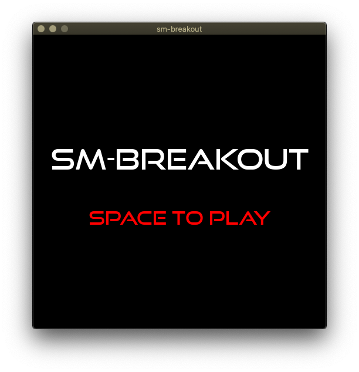
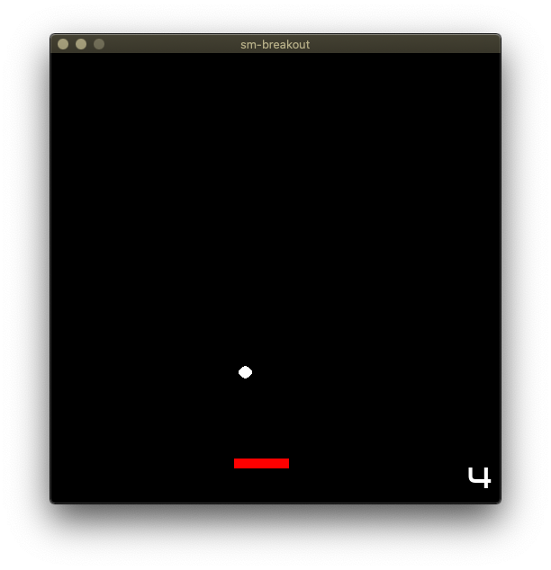

A Breakout prototype, for exploring haskell game dev.
This was one of my first Haskell projects, in 2007, now updated in 2020.

## Install

It should build on any platform which has the SDL C libs and GHC 8.10+.
For now, it should be run from the source directory, to find files in `./data/*`.

1. Install SDL v2 libs for your system ([1], [2], ...)
2. `gh repo clone simonmichael/sm-breakout`
3. `cd sm-breakout`
4. `stack run`

[1]: https://www.libsdl.org/download-2.0.php
[2]: https://repology.org/project/sdl/badges

Writing more here may be the kiss of death... but assuming this project continues:

## Goals

This project's goals are:

- Provide amusement and re-creation for myself
- Research, learn, uplevel my [haskell] game dev powers
- Experiment with tools, techniques, architectures, practices
- Minimise toil (non-energising work)

and secondary/stretch goals would be:

- Stimulate more haskell game development
- Provide new, maintained examples of a small haskell game implemented several ways, useful for learning or as starter templates
- Produce a more fun and impressive game that raises the bar for haskell games

## Help

I'm glad to receive your feedback or help via the #haskell-game chat channel.
Access it with an [IRC](https://webchat.freenode.net/#haskell-game) or [Matrix](https://matrix.to/#/#freenode_#haskell-game:matrix.org) client.

There is no issue tracker and no email support.
Pull requests may or may not get merged, at my discretion. 
Forks, complementary experiments, and non-costly collaboration are welcome.
(*Minimise toil*)

There's a [CHANGELOG.md](CHANGELOG.md) and a rough [TODO.md](TODO.md).
